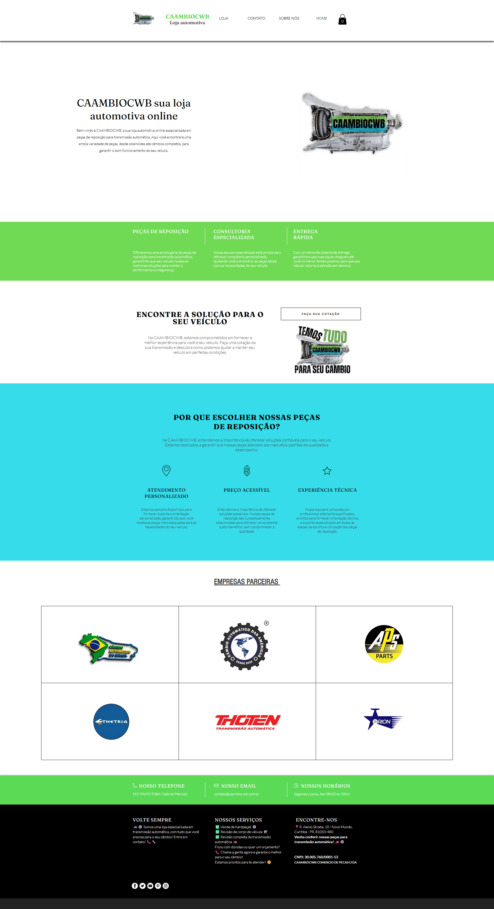
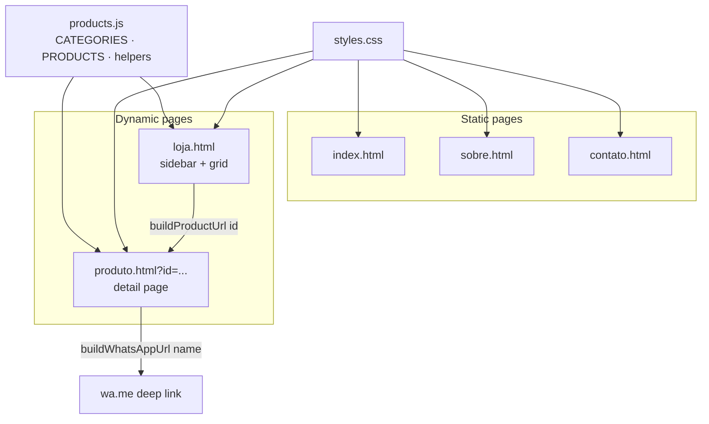

# CAAMBIOCWB — Automatic Transmission Parts Catalog

A static, data-driven storefront for an automatic-transmission (auto câmbio) parts business. Multi-page catalog built with plain HTML, CSS, and JavaScript — no framework, no build step. Buyers browse parts by transmission model and open a pre-filled WhatsApp quote in one click.




---

## Context

Rebuilding, repairing, and reselling parts for automatic transmissions is a specialist niche: catalogs are organized not by "car brand" but by the transmission unit itself (6T30, 6R80, AL4, JF011, and dozens more), because the same gearbox is shared across many vehicles. A generic e-commerce template models the wrong dimension.

This site is a lightweight, no-backend catalog for exactly that domain. It presents parts grouped by transmission model, gives each part its own detail page, and — since a rebuilt gearbox part is quoted case by case, not sold with a fixed cart price — routes every "buy" action to WhatsApp with the part name already filled in. The whole thing is static files that can be hosted anywhere.

## Features

- **Data-driven catalog.** All catalog content — the list of transmission-model categories and the products themselves — lives in a single `products.js` file. Adding a part means appending one object to the `PRODUCTS` array; no HTML editing.
- **Category filtering with deep links.** The shop page (`loja.html`) builds the category sidebar and product grid client-side and filters by URL hash, so a category view like `loja.html#JF011` is directly shareable and bookmarkable.
- **Per-product pages.** `produto.html?id=<id>` renders a full detail page (breadcrumbs, category tag, short + long description) from the query-string id, with a graceful "product not found" state for unknown or removed ids.
- **One-tap WhatsApp quote.** The product detail page's primary CTA is a `wa.me` deep link generated from the part name and the configured business number (`WHATSAPP_NUMBER` in `products.js`).
- **Output escaping.** Data-driven strings inserted as element content or into non-URL attributes are passed through an `escapeHtml()` helper before `innerHTML` assignment. Values used to build `href` URLs are encoded with `encodeURIComponent` instead (via `buildProductUrl` / `buildWhatsAppUrl` and the inline hash links).
- **Responsive layout.** Hand-written CSS Grid with breakpoints at 960px and 720px; the sidebar, product grids, and hero sections collapse cleanly to a single column on mobile.
- **Static informational pages.** The Home, About (`sobre.html`), and Contact (`contato.html`) pages share a common header, footer, and contact strip; the Home page additionally carries the partner logo grid ("Empresas Parceiras").

## Tech stack

| Layer | Choice |
| --- | --- |
| Markup | HTML5, one file per page |
| Styling | Hand-written CSS3 (CSS custom properties, Grid, Flexbox) — no framework |
| Behavior | Vanilla JavaScript (browser-native `URLSearchParams`, `location.hash`, `history` API) — no bundled dependencies |
| Icons | Font Awesome 6.5.2 (via CDN) |
| Fonts | Google Fonts — Montserrat & Oswald (via CDN) |
| Build / tooling | None |

## Architecture

Every page is a plain HTML document that links the shared `styles.css`. The two dynamic pages additionally load `products.js` — the single source of truth for catalog data and URL helpers — and render their markup at runtime from that data.



Data flow on the shop page: `getProductsByCategory(category)` filters `PRODUCTS`, the category comes from the URL hash, and clicking a card navigates to `produto.html?id=<id>`. On the detail page: `getProductById(id)` looks the part up and `buildWhatsAppUrl(name)` produces the quote link. There is no server, database, or API call — the "backend" is a JavaScript array shipped to the browser.

## Getting started

### Prerequisites
Just a modern web browser. An internet connection is needed for the CDN-hosted fonts and icons to render. Optionally, any static file server for a clean local URL.

### Run locally
Clone the repository and open it directly:

```bash
git clone https://github.com/<user>/caambiocwb.git
cd caambiocwb
```

Then either open `index.html` in your browser, or serve the folder (recommended, gives you real paths for the query-string / hash routing):

```bash
python3 -m http.server 8000
# then visit http://localhost:8000
```

### Build & tests
There is no build step and no test suite — the files are served as-is.

### Add or edit a product
Edit `products.js`. Each product is an object in the `PRODUCTS` array; each `category` value must match an entry in the `CATEGORIES` array exactly, and each `id` must be unique. The in-file comments document every field.

## Project structure

```
.
├── index.html            # Home page (hero, service strips, partner logo grid)
├── sobre.html            # About page
├── contato.html          # Contact page (front-end-only form)
├── loja.html             # Shop: category sidebar + product grid (renders from products.js)
├── produto.html          # Product detail page (reads ?id=, renders from products.js)
├── products.js           # Catalog data (CATEGORIES, PRODUCTS) + URL/WhatsApp helpers
├── styles.css            # Full design system and responsive rules
├── parceiros/            # Partner company logos (.avif)
├── *.avif                # Brand logo assets
├── visualcompleto.png    # Full-page design reference render
└── *.md                  # Plaintext content references from the original site
```

## Status & limitations

Personal/client project — a real small-business catalog site, kept intentionally simple. Honest boundaries:

- **No backend.** The contact form (`contato.html`) is front-end only: it prevents default submission and shows a JavaScript `alert`; it does not send email. The header "cart" counter is a static `0` — there is no cart or checkout by design; ordering happens over WhatsApp and phone.
- **Sample catalog.** `products.js` ships 15 example parts spanning 11 of the 37 defined transmission-model categories; it is a working template meant to be populated, not a full inventory.
- **CDN dependencies.** Icons and fonts load from external CDNs, so the page needs internet access to render exactly as designed.
- **Portuguese UI.** All on-page copy is Brazilian Portuguese — the site targets the Brazilian market.
- **Placeholder social links.** Footer social icons are present but point at `#`.

## License

Released under the MIT License — see [`LICENSE`](LICENSE).
